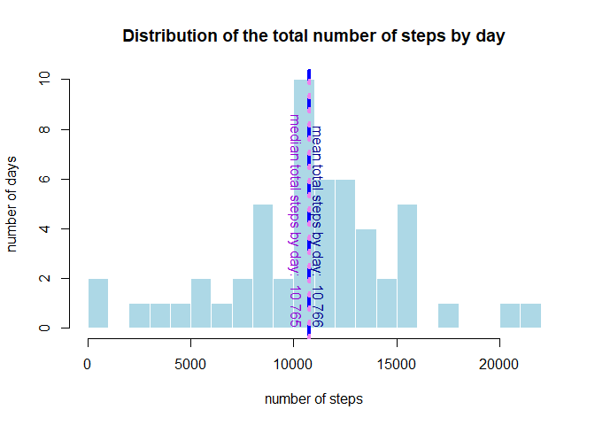
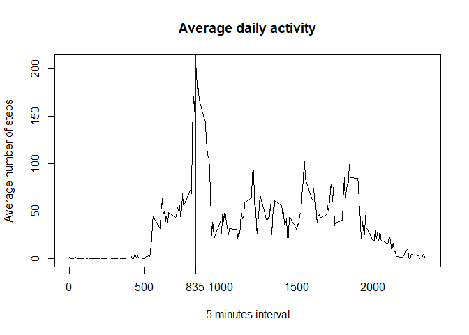
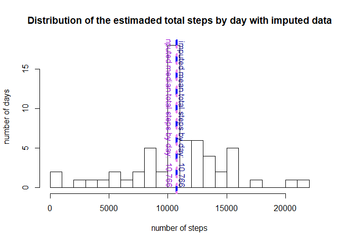
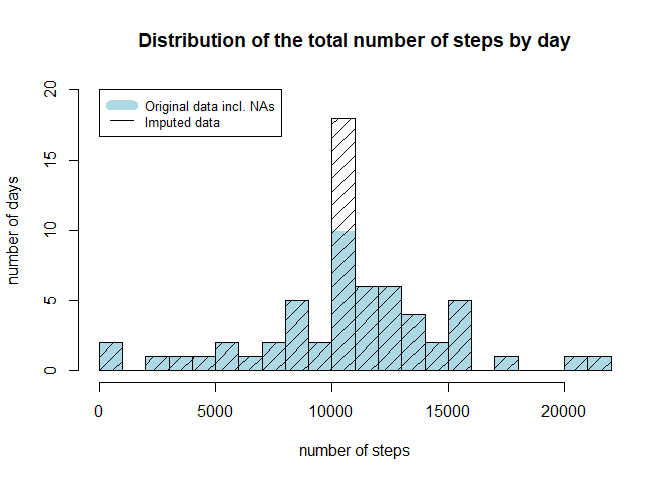
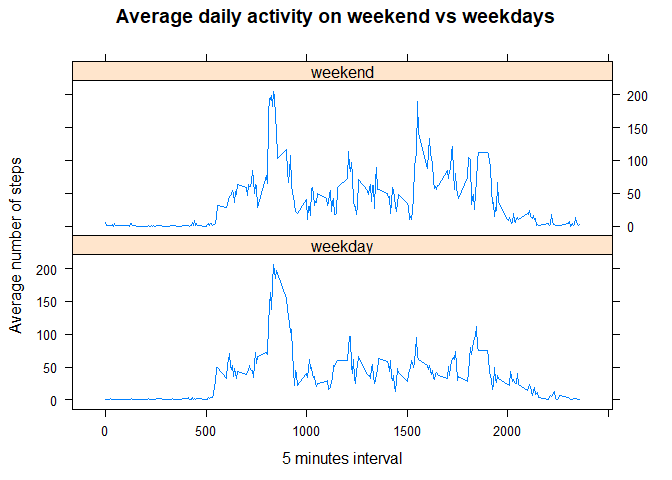

## Preparing the environment

Loading required libraries

```r
#install.packages("dplyr") # uncomment if you need to install this library 
library(dplyr, quietly = TRUE, warn.conflicts = FALSE)
#install.packages("knitr") # uncomment if you need to install this library 
library(knitr, quietly = TRUE, warn.conflicts = FALSE)
#install.packages("lattice") # uncomment if you need to install this library 
library(lattice)
```

Setting Knitr global options

```r
opts_chunk$set(echo = TRUE, results = "markup")
```

Clearing the environment

```r
rm(list=ls())
```

Setting the working directory

```r
setwd("C:\\R\\RepData_PeerAssessment1") # adjsut to your own working repository
```


## Loading the data

```r
unzip(zipfile="activity.zip")
activity=read.csv("activity.csv",sep=",",header=TRUE)
str(activity)
```

```
## 'data.frame':	17568 obs. of  3 variables:
##  $ steps   : int  NA NA NA NA NA NA NA NA NA NA ...
##  $ date    : Factor w/ 61 levels "2012-10-01","2012-10-02",..: 1 1 1 1 1 1 1 1 1 1 ...
##  $ interval: int  0 5 10 15 20 25 30 35 40 45 ...
```


## What is mean total number of steps taken per day?

Summarizing the total number of steps by day

```r
steps_by_day<-summarize(group_by(activity,date),steps=sum(steps))
str(steps_by_day)
```

```
## Classes 'tbl_df', 'tbl' and 'data.frame':	61 obs. of  2 variables:
##  $ date : Factor w/ 61 levels "2012-10-01","2012-10-02",..: 1 2 3 4 5 6 7 8 9 10 ...
##  $ steps: int  NA 126 11352 12116 13294 15420 11015 NA 12811 9900 ...
```

Getting the mean total number of steps by day

```r
mean_steps_by_day<-round(mean(steps_by_day$steps,na.rm=TRUE))
mean_steps_by_day_t<-format(mean_steps_by_day,big.mark=" ", big.interval=3)
```
###The mean total number of stepy by day is: 10 766

Getting the median total number of steps by day

```r
median_steps_by_day<-round(median(steps_by_day$steps,na.rm=TRUE))
median_steps_by_day_t<-format(median_steps_by_day,big.mark=" ", big.interval=3)
```
###The median total number of stepy by day is: 10 765

Visualizing on a histogram "Distribution of the total number of steps by day"

```r
hist(steps_by_day$steps
     , breaks=20
     , main="Distribution of the total number of steps by day"
     , xlab="number of steps"
     , ylab="number of days"
     , col="lightblue"
     , border=FALSE
     )
abline(v=mean_steps_by_day
       , col="blue"
       , lwd=4
       , lty=2)
text(mean_steps_by_day*1.08, 0
     , pos=2
     , paste("mean total steps by day: ", mean_steps_by_day_t)
     , srt=-90
     , col = "darkblue")
abline(v=median_steps_by_day
       ,col="violet"
       ,lwd=4
       ,lty=3)
text(median_steps_by_day*0.98, 0
     , pos=2
     , paste("median total steps by day: ", median_steps_by_day_t)
     , srt=-90
     , col = "darkviolet")
```

<!-- -->


## What is the average daily activity pattern?

Summarizing the average number of steps by interval

```r
steps_pattern<-summarize(group_by(activity,interval)
                         , steps=mean(steps,na.rm=TRUE))
```

Getting the activity peak interval and number of steps

```r
peak<-subset(steps_pattern
             , steps==max(steps_pattern$steps))
```

Visualizing on a line chart "Average daily activity"

```r
plot(steps_pattern
     , type="l"
     , xlab="5 minutes interval"
     , ylab="Average number of steps"
     , main="Average daily activity")
abline(v=peak$interval
       , col="blue"
       , lwd=2
       , lty=1)
axis(1,at=peak$interval,label=peak$interval)	
```

<!-- -->

###The 5-minute interval containing the maximum number of steps averaged 
###across all days is: 835


## Imputing missing values

Calculating the total number of missing values in the dataset

```r
nb_na<-length(activity$steps[is.na(activity$steps)])
nb_na_t<-format(nb_na,big.mark=" ", big.interval=3)
```
###The number of missing values is: 2 304


Creating a new dataset equal to the original but with the missing data filled in

```r
activity2 <- activity
activity2$steps[is.na(activity2$steps)] <-
    subset(steps_pattern,interval=activity2$interval)$steps
```

Starting Comparison...
Summarizing the imputed total number of steps by day

```r
steps_by_day2<-summarize(group_by(activity2,date),steps=sum(steps))
str(steps_by_day2)
```

```
## Classes 'tbl_df', 'tbl' and 'data.frame':	61 obs. of  2 variables:
##  $ date : Factor w/ 61 levels "2012-10-01","2012-10-02",..: 1 2 3 4 5 6 7 8 9 10 ...
##  $ steps: num  10766 126 11352 12116 13294 ...
```

Getting the imputed mean total number of steps by day

```r
mean_steps_by_day2<-round(mean(steps_by_day2$steps,na.rm=TRUE))
mean_steps_by_day2_t<-format(mean_steps_by_day2,big.mark=" ", big.interval=3)
```
###The estimated mean total number of stepy by day with imputed data is: 10 766
The NA values did not influence the mean total number of steps

Getting the imputed median total number of steps by day

```r
median_steps_by_day2<-round(median(steps_by_day2$steps,na.rm=TRUE))
median_steps_by_day2_t<-format(median_steps_by_day2,big.mark=" ",big.interval=3)
```
###The estimated median total number of stepy by day with imputed data is: 10 766
The NA values did not influence much the meadian total number of steps

Visualizing on a histogram "Distribution of the imputed total steps by day"

```r
hist(steps_by_day2$steps
     , breaks=20
     , main="Distribution of the estimaded total steps by day with imputed data"
     , xlab="number of steps"
     , ylab="number of days")
abline(v=mean_steps_by_day2
       , col="blue"
       , lwd=4
       , lty=2)
text(mean_steps_by_day2*1.08, 0
     , pos=2
     , paste("imputed mean total steps by day: "
             , format(mean_steps_by_day2,big.mark=" ", big.interval=3))
     , srt=-90
     , col = "darkblue")
abline(v=median_steps_by_day2
       ,col="violet"
       ,lwd=4
       ,lty=3)
text(median_steps_by_day2*0.98, 0
     , pos=2
     , paste("imputed median total steps by day: "
             , format(median_steps_by_day2, big.mark=" ", big.interval=3))
     , srt=-90
     , col = "darkviolet")
```

<!-- -->


To better compare the impact of the NA values, 
let's display the two histograms overlaying in a single diagram

```r
hist(steps_by_day$steps
     , breaks=20
     , main="Distribution of the total number of steps by day"
     , xlab="number of steps"
     , ylab="number of days"
     , ylim=c(0,20)
     , col="lightblue"
     , border=FALSE)
hist(steps_by_day2$steps
     , breaks=20
     , col="black"
     , density=10
     , angle=45
     , border=TRUE
     , add=TRUE
    )
legend(1, 20
       ,legend=c("Original data incl. NAs","Imputed data")
       ,col=c("lightblue","black")
       ,lty=c(1,1)
       ,lwd=c(10,1)
       ,cex=0.8)
```

<!-- -->

By imputing missing data, the estimated total daily number of steps
is quite similar than with the NAs, expected for the interval having 
the peak distribution, which have a higher estimated number of days.


## Are there differences in activity patterns between weekdays and weekends?
Add a column for a weekend/weekday factor

```r
activity2$weekend <- ifelse(weekdays(as.Date(activity2$date,"%Y-%M-%d"))
                            %in%c("Saturday","Sunday")
                            , "weekend"
                            , "weekday")
activity2$weekend <- as.factor(activity2$weekend)
```

Summarizing the average number of steps by interval for weekend vs weekdays

```r
steps_pattern2<-summarize(group_by(activity2,interval,weekend)
                              ,steps=mean(steps,na.rm=TRUE))
```

Visualizing on two line graph "Average daily activity on weekend vs weekdays"

```r
xyplot(steps ~ interval | weekend
       , data=steps_pattern2
       , layout= c(1,2)
       , xlab="5 minutes interval"
       , ylab="Average number of steps"
       , main="Average daily activity on weekend vs weekdays"
       , type="l")
```

<!-- -->

The activity during the weekend is quite similar than during the week days,
with the exception of an activity peak during the weekend afternoons
after the time interval 1500

